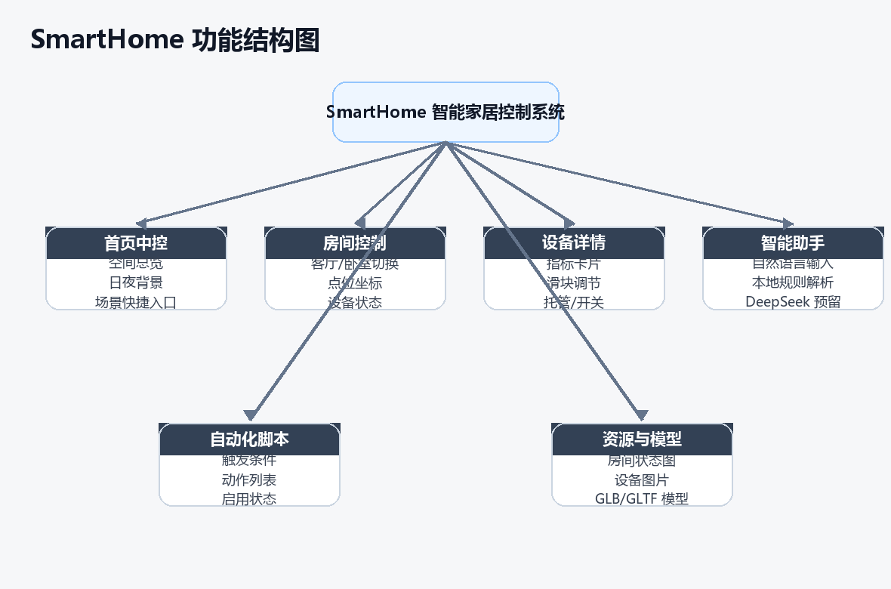
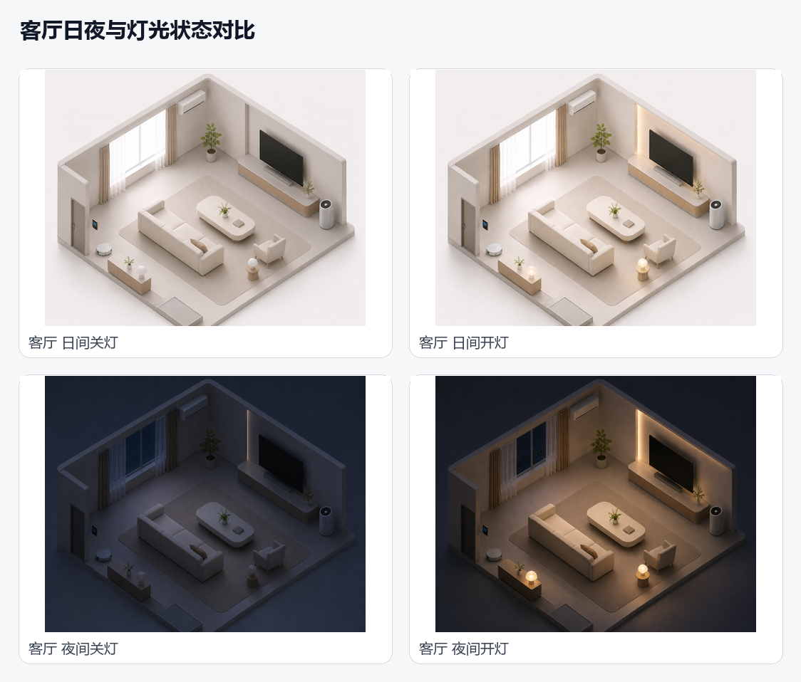
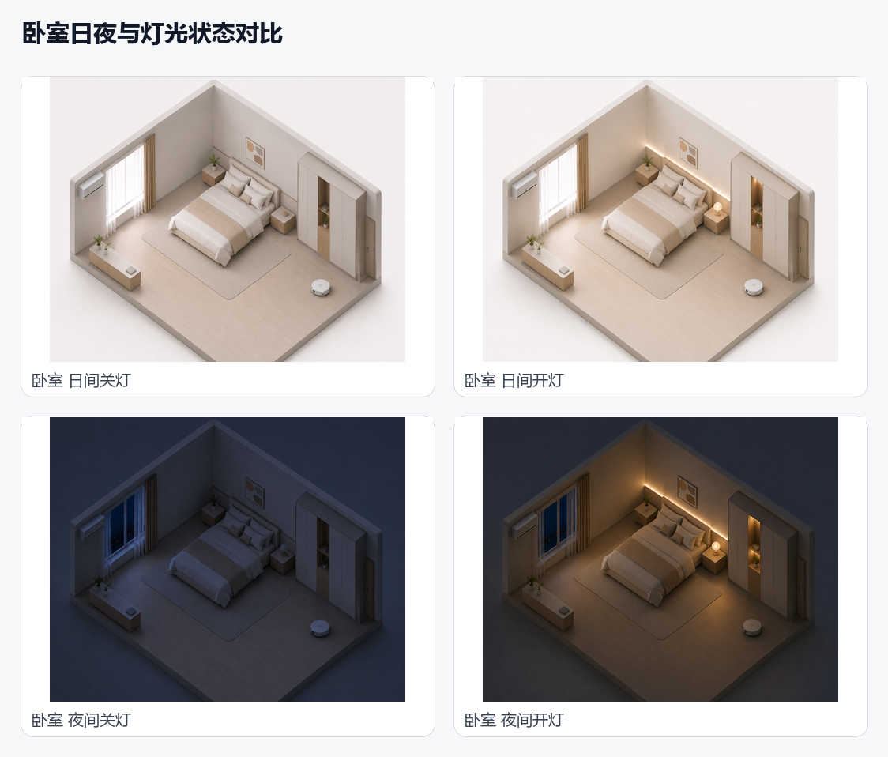
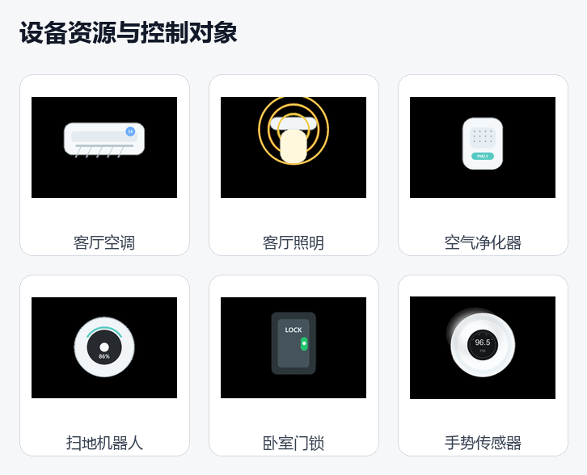
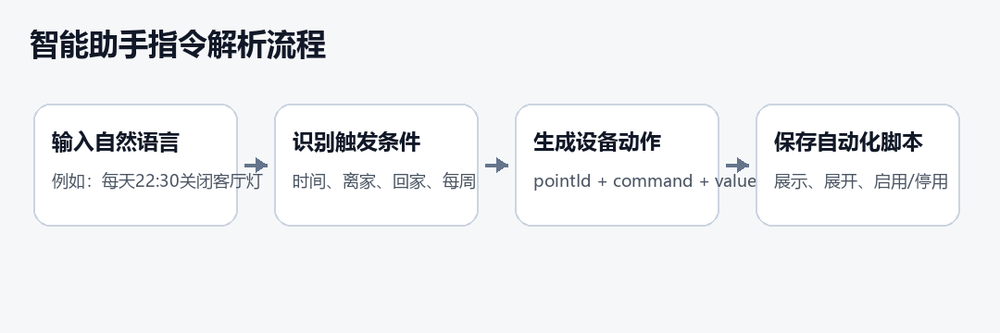
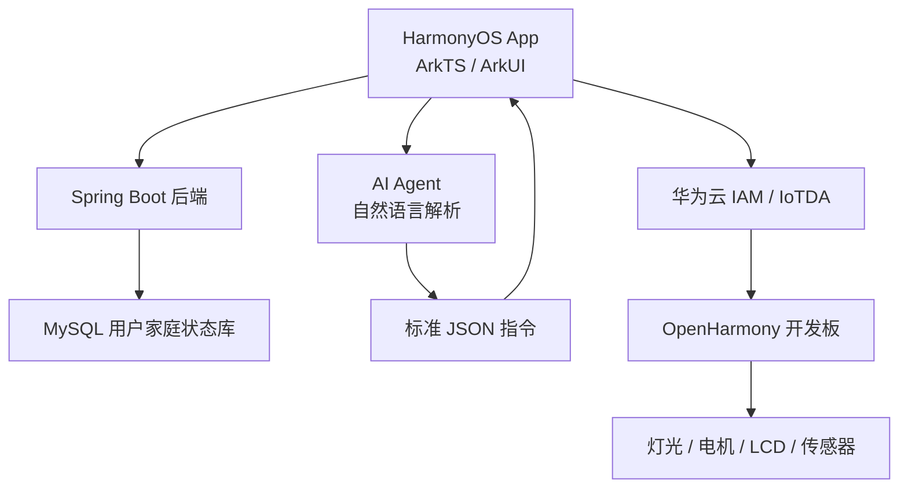
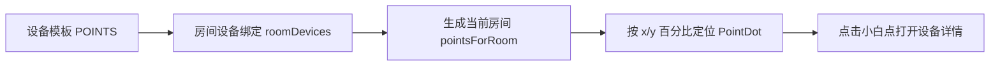
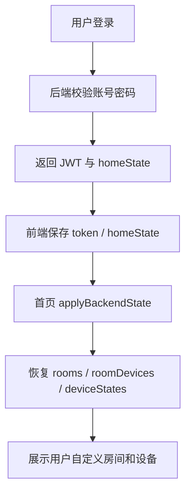
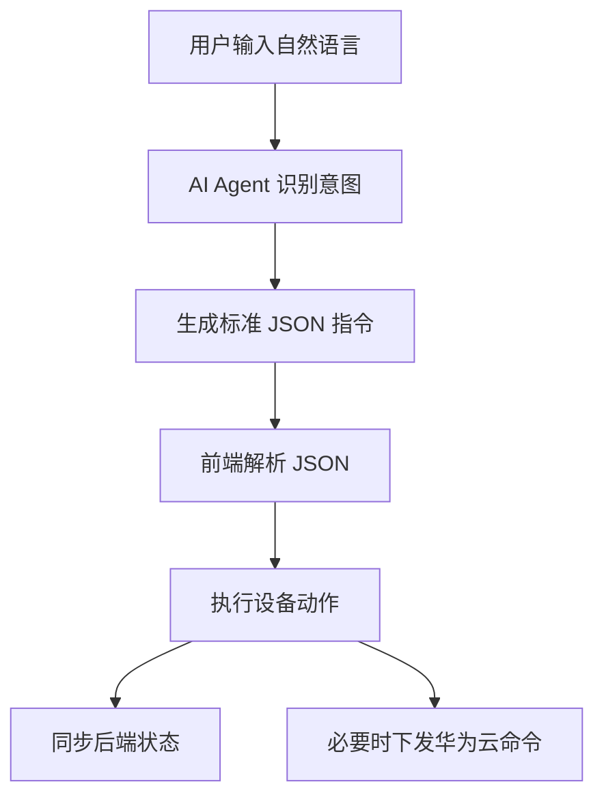
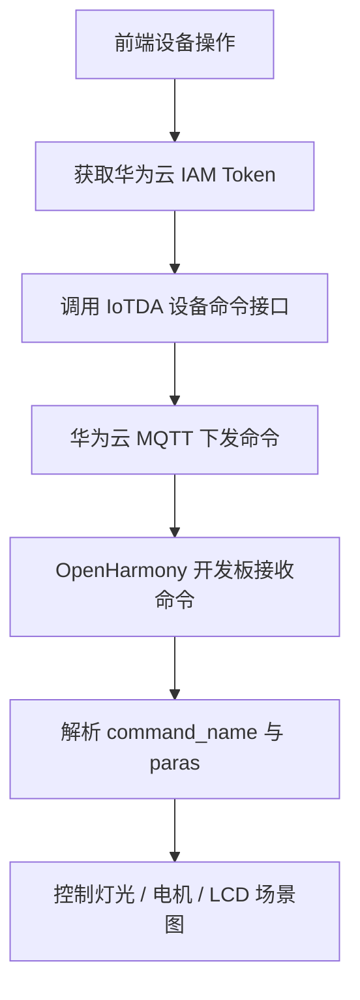

# SmartHome 智能家居中控系统

> 基于 HarmonyOS ArkTS / ArkUI 的空间化智能家居控制应用，集成账号同步、2.5D 房间视图、设备控制、AI Agent、商城闭环与华为云 IoTDA 硬件联动。



## 项目简介

SmartHome 是一套面向家庭用户的智能家居中控原型。项目以“先看见家，再操作设备”为核心思路，将传统设备列表升级为可视化 2.5D 房间视图：用户可以在客厅、卧室等空间图片上直接点击设备点位，完成灯光、空调、窗帘、电视、空气净化器、扫地机器人、门锁等设备的控制。

项目同时接入 Spring Boot 后端用于账号鉴权和家庭状态持久化，并通过华为云 IoTDA 将前端控制命令下发到 OpenHarmony 开发板，实现从软件界面到真实硬件的控制闭环。

## 技术栈

| 层级 | 技术 |
| --- | --- |
| 移动端前端 | HarmonyOS、ArkTS、ArkUI、Stage 模型、AppStorage / StorageLink |
| 后端服务 | Spring Boot、Spring MVC、JWT、JdbcTemplate、Flyway |
| 数据存储 | MySQL、JSON 字段持久化用户家庭状态 |
| AI Agent | DeepSeek 调用、本地规则兜底解析、结构化 JSON 指令 |
| 云端与硬件 | 华为云 IAM、IoTDA、MQTT、OpenHarmony、E53 传感器模块 |
| 工程工具 | DevEco Studio、Hvigor、Maven、Docker Compose |

## 核心亮点

- **空间化中控**：用 2.5D 房间图承载设备点位，设备不再只是列表项，而是绑定到真实空间位置。
- **响应式点位绑定**：设备坐标使用图片百分比定位，不同屏幕尺寸下小白点仍能准确落在家具或电器位置。
- **账号级数据同步**：登录后自动加载个人房间、设备、场景、自动化和偏好数据。
- **AI Agent 控制**：将自然语言解析成标准 JSON 指令，支持立即执行和自动化脚本生成。
- **硬件闭环**：前端命令经华为云 IoTDA 下发到开发板，控制灯光、电机和 LCD 场景展示。
- **商城与我的模块**：补齐商品详情、购物车、订单、登录、个人中心、家庭管理等完整应用链路。

## 软件页面截图

### 首页 2.5D 空间视图

客厅视图支持日间、夜间、开灯、关灯多状态切换，设备点位与空间图绑定。



### 卧室空间视图

卧室同样支持多状态切换，并通过点位映射床头灯、窗帘、空调、门锁和扫地机器人等设备。



### 设备资源与控制对象

设备资源按类型抽象为控制对象，每个设备具备名称、类型、点位、动作类型和状态值。



### AI Agent 指令流程

AI Agent 将自然语言转换为标准 JSON，再由前端执行设备动作或生成自动化脚本。



## 系统架构



## 功能模块

| 模块 | 实现内容 |
| --- | --- |
| 首页中控 | 房间切换、2.5D 图片、小白点点位、设备详情、场景控制、日夜模式 |
| 智能助手 | 自然语言识别、JSON 指令生成、自动化脚本、聊天记录、执行日志 |
| 商城模块 | 商城首页、商品分类、商品详情、购物车、结算、订单、物流、售后 |
| 我的模块 | 我的主页、登录状态、账号入口、个人资料、设备中心、家庭管理、消息中心 |
| 后端服务 | 注册登录、JWT 鉴权、家庭状态同步、设备状态更新、商城地址管理 |
| 硬件联动 | 华为云 Token 获取、IoTDA 命令下发、MQTT 接收命令、开发板执行控制 |

## 2.5D 点位绑定原理

房间图作为底图展示，设备点位由 `POINTS` 表维护，每个点位包含：

```ts
{
  id: 'living_air',
  roomId: 'living',
  name: '空调',
  type: '温控',
  x: 47,
  y: 14,
  action: 'temperature'
}
```

其中 `x` 和 `y` 是相对于房间图片的百分比坐标。渲染时通过 `dotLeft()` 和 `dotTop()` 转换为 ArkUI 的百分比定位，并减去小白点自身半径偏移，让点位中心对准设备。



这种方式可以保证房间图片在不同手机、平板尺寸下等比例缩放时，设备点位仍然准确贴合空调、电视、灯具等位置。

## 用户数据同步流程

用户登录成功后，后端返回 `token + user + homeState`。前端将 token 存入 `lumiAuthToken`，将家庭状态序列化存入 `lumiHomeState`。首页启动时读取本地缓存，并在有 token 时请求后端最新状态。



自定义房间、新增设备、设备状态、自动化脚本都会按用户维度保存到 `user_home_states` 表中，因此同一账号再次登录时可以恢复自己的空间配置。

## AI Agent 架构

AI Agent 负责把用户自然语言转换为可执行的结构化指令。它的输出不是直接操作 UI，而是生成标准 JSON，由前端再解析执行。

```json
{
  "intent": "smart_home",
  "trigger": {
    "type": "manual",
    "label": "立即执行"
  },
  "actions": [
    {
      "pointId": "living_light",
      "command": "off",
      "label": "关闭客厅灯"
    }
  ]
}
```



## 硬件控制链路

前端不直接连接开发板，而是通过华为云 IoTDA 完成命令转发。



命令示例：

```json
{
  "service_id": "智慧农业",
  "command_name": "紫光灯控制",
  "paras": {
    "Light": "ON"
  }
}
```

开发板侧接收到命令后，根据 `command_name` 判断控制类型：`紫光灯控制` 对应灯光开关，`电机控制` 对应电机动作，同时 LCD 可展示早安、回家等场景图片。

## 后端数据设计

后端采用“用户 + 家庭状态快照”的设计。每个用户有一条家庭状态记录，房间、设备绑定、设备状态、场景、自动化、消息等内容以 JSON 字段存储。

| 表 | 作用 |
| --- | --- |
| `users` | 保存账号、密码哈希、昵称 |
| `user_home_states` | 保存用户家庭状态 JSON 快照 |
| `action_logs` | 记录设备动作和执行状态 |
| `user_store_addresses` | 保存商城地址和默认地址 |

这种结构适合智能家居原型快速扩展，因为房间、设备和自动化字段可以灵活演进，不需要频繁调整数据库表结构。

## 项目目录

```text
SmartHome/
  entry/src/main/ets/pages/Index.ets       # 主入口、底部 tab、首页中控、智能助手
  entry/src/main/ets/pages/store/          # 商城页面
  entry/src/main/ets/pages/my/             # 我的页面
  entry/src/main/ets/common/               # API、路由、华为云封装
  entry/src/main/ets/smart/                # AI Agent 模型与解析逻辑
  backend/src/main/java/com/smarthome/api/ # Spring Boot 后端
  remote_edit/                             # OpenHarmony 硬件侧代码
  report_assets/                           # 项目展示截图与图示
```

## 运行方式

### 前端

1. 使用 DevEco Studio 打开项目根目录。
2. 等待 Hvigor 与依赖加载完成。
3. 选择 `entry` 模块。
4. 使用 Previewer 或模拟器运行。

启动链路：

```text
EntryAbility -> windowStage.loadContent('pages/Index') -> Index.ets
```

### 后端

后端位于 `backend/`，可通过 Maven 或 Docker Compose 运行。默认服务端口为 `8080`，数据库连接配置在 `application.yml` 中。

```bash
cd backend
mvn spring-boot:run
```

## 项目总结

SmartHome 将智能家居的“设备控制”做成了“空间交互”：用户可以在 2.5D 家庭视图中直接看到设备、选择设备、控制设备。同时，项目通过后端实现账号级数据同步，通过 AI Agent 实现自然语言控制，通过华为云 IoTDA 实现真实硬件下发，形成了一条从界面、数据、智能到硬件的完整闭环。
