<p align="right">
  <a href="./README.md">中文</a> | English
</p>

<h1 align="center">SmartHome Intelligent Home Control System</h1>

<p align="center">
  A spatial smart-home control app built with HarmonyOS ArkTS / ArkUI, featuring 2.5D room views, account-level sync, AI Agent control, shopping flows, and Huawei Cloud IoTDA hardware integration.
</p>

<p align="center">
  
  
  
  
  
</p>

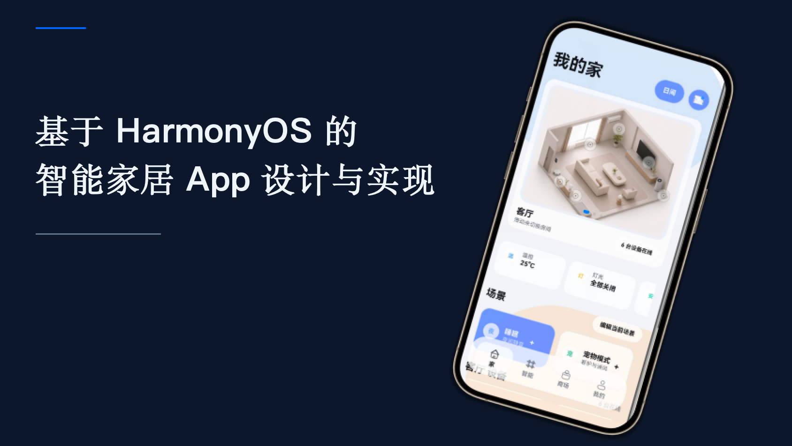

## Overview

SmartHome is an intelligent home control prototype designed for household users. Instead of presenting devices as a flat list, it starts from a 2.5D spatial home view. Users can tap device points directly on living room and bedroom scenes to control lights, air conditioners, curtains, TVs, air purifiers, robot cleaners, door locks, and more.

The project also includes a Spring Boot backend for authentication and home-state persistence, plus Huawei Cloud IoTDA integration for sending control commands from the app to an OpenHarmony development board. Together, they form an end-to-end loop from software UI to real hardware execution.

## Tech Stack

| Layer | Technologies |
| --- | --- |
| Mobile App | HarmonyOS, ArkTS, ArkUI, Stage model, AppStorage / StorageLink |
| Backend | Spring Boot, Spring MVC, JWT, JdbcTemplate, Flyway |
| Database | MySQL, JSON-based user home-state persistence |
| AI Agent | DeepSeek integration, local rule fallback parser, structured JSON commands |
| Cloud & Hardware | Huawei Cloud IAM, IoTDA, MQTT, OpenHarmony, E53 sensor module |
| Tooling | DevEco Studio, Hvigor, Maven, Docker Compose |

## Highlights

- **Spatial Control Surface**: Devices are bound to physical positions inside 2.5D room views.
- **Responsive Point Binding**: Device points use percentage coordinates, so they remain aligned when room images scale across phones and tablets.
- **Account-Level Sync**: User rooms, device bindings, scenes, automations, and preferences are restored after login.
- **AI Agent Control**: Natural language commands are converted into standard JSON actions for immediate execution or automation creation.
- **Hardware Loop**: App commands are sent through Huawei Cloud IoTDA to control lights, motors, and LCD scene display on the board.
- **Shopping & Profile Modules**: Product details, cart, orders, login, account entry, personal center, and family management are included.

## Screenshots

### App Home

The app home presents the spatial smart-home entry, combining home control, smart assistant, store, and profile access.

<p align="center">
  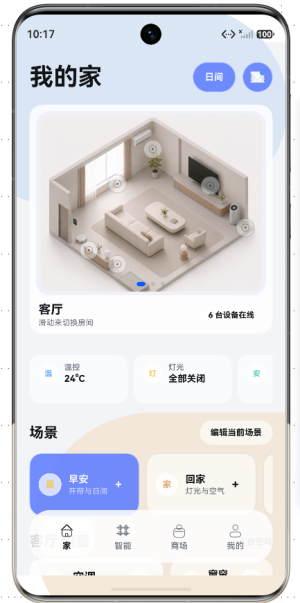
</p>

### My Home 2.5D View

The "My Home" page uses a 2.5D room image as the main control surface, with device points bound directly to spatial positions.

<p align="center">
  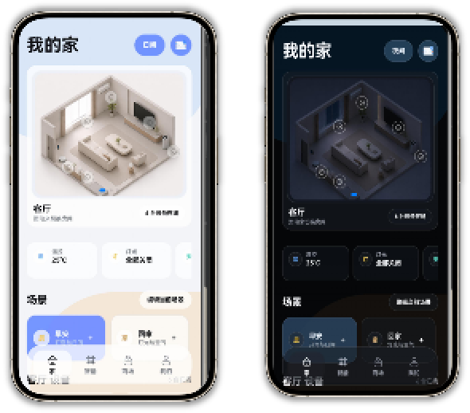
  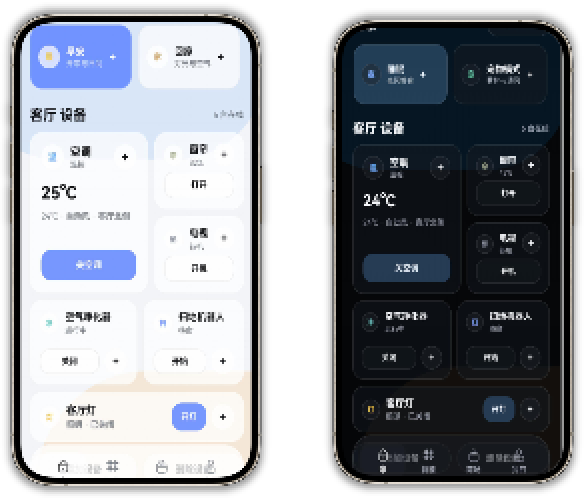
</p>

### Store Module

The store module covers smart-home product browsing, recommendations, purchase entry, and service flows.

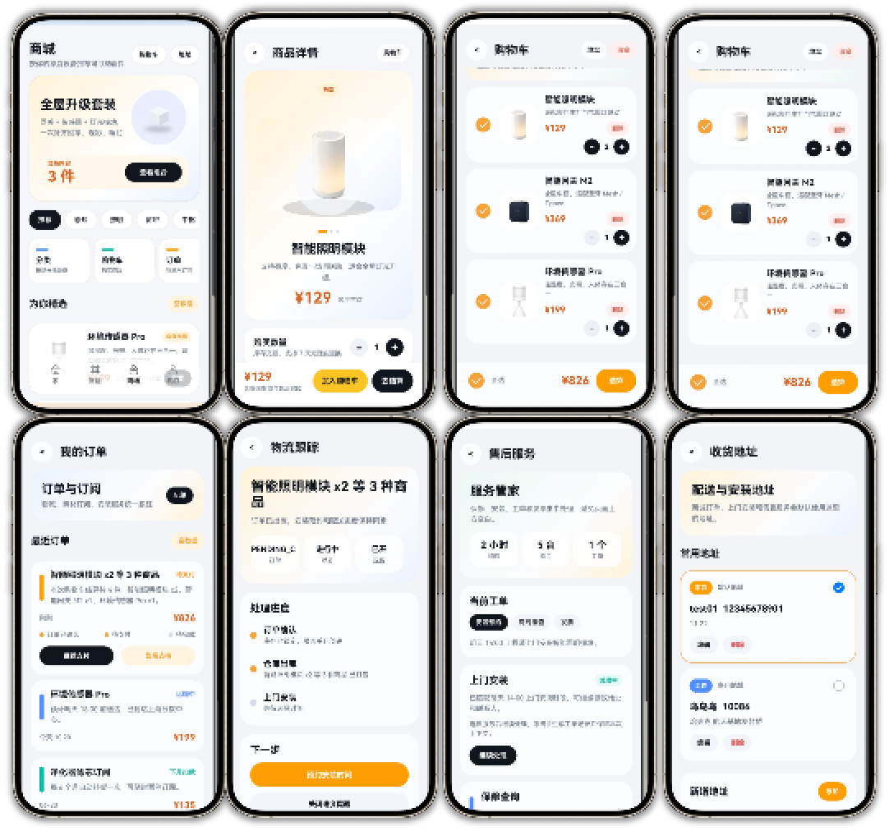

### Profile Module

The profile module aggregates account status, family entry, device center, messages, and personal services.

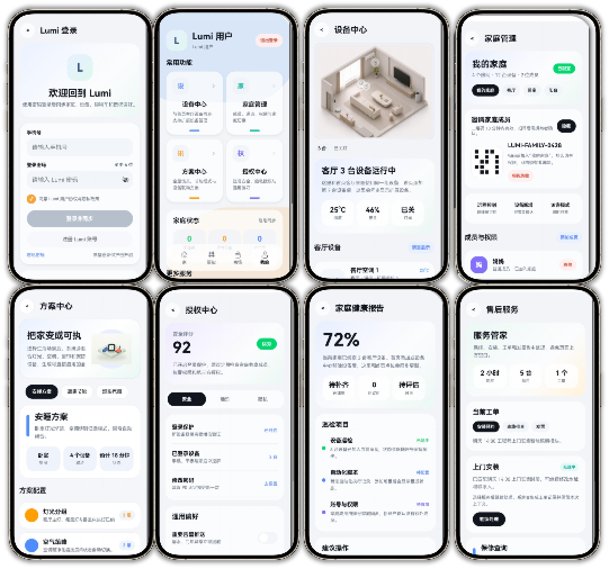

## Architecture

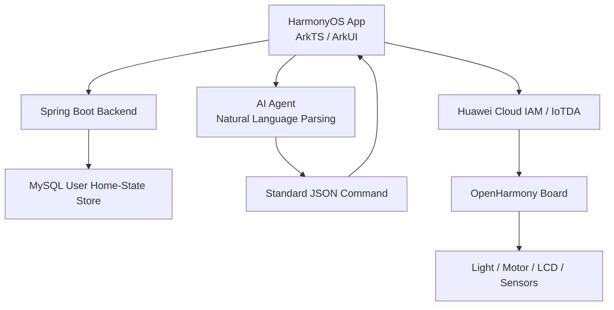

## Modules

| Module | Features |
| --- | --- |
| Home Control | Room switching, 2.5D images, device points, detail panel, scenes, day/night mode |
| Smart Assistant | Natural language recognition, JSON commands, automation scripts, chat records, execution logs |
| Store | Store home, categories, product detail, cart, checkout, orders, tracking, after-sales |
| Profile | Profile home, login status, account entry, personal info, device center, family management, messages |
| Backend | Register/login, JWT auth, home-state sync, device-state update, store address management |
| Hardware | Huawei Cloud token, IoTDA commands, MQTT command receiving, board-side execution |

## 2.5D Point Binding

Room images are rendered as scene backgrounds. Device points are maintained in the `POINTS` table. Each point includes device ID, room ID, name, type, action type, and relative image coordinates:

```ts
{
  id: 'living_air',
  roomId: 'living',
  name: 'Air Conditioner',
  type: 'Climate',
  x: 47,
  y: 14,
  action: 'temperature'
}
```

`x` and `y` are percentage coordinates relative to the room image. During rendering, `dotLeft()` and `dotTop()` convert them into ArkUI percentage positions and subtract the dot radius offset, so the center of the dot aligns with the actual device.

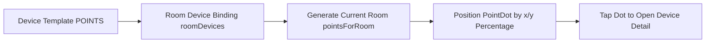

This keeps device dots aligned with air conditioners, TVs, lights, and other appliances even when the room image scales on different screen sizes.

## User Data Sync

After login, the backend returns `token + user + homeState`. The frontend stores the token in `lumiAuthToken` and serializes the home state into `lumiHomeState`. When the home page starts, it reads the local cache and, if a token exists, fetches the latest server state.

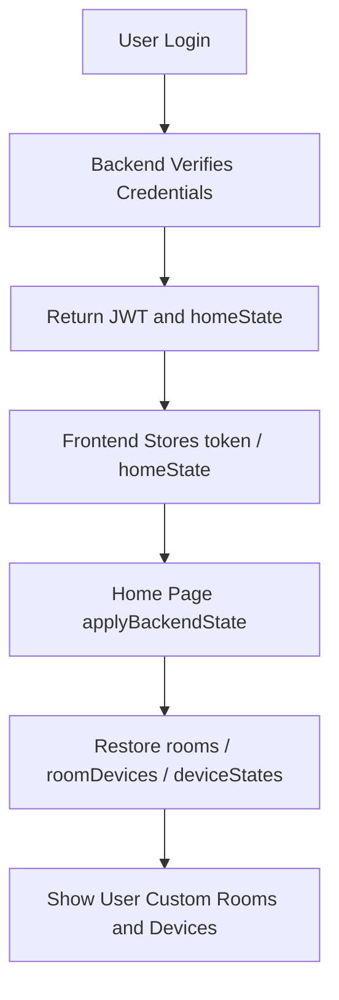

Custom rooms, newly added devices, device states, and automation scripts are saved per user in the `user_home_states` table. When the same account logs in again, the app restores the user's spatial configuration.

## AI Agent

The AI Agent converts natural language into executable structured commands. It does not operate the UI directly; instead, it generates standard JSON that the frontend parses and executes.

```json
{
  "intent": "smart_home",
  "trigger": {
    "type": "manual",
    "label": "Run now"
  },
  "actions": [
    {
      "pointId": "living_light",
      "command": "off",
      "label": "Turn off living room light"
    }
  ]
}
```

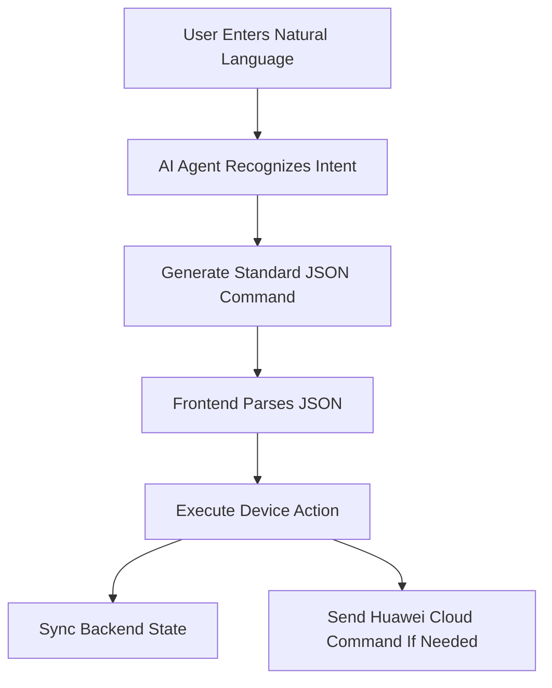

## Hardware Control Flow

The app does not connect to the board directly. Instead, it forwards commands through Huawei Cloud IoTDA.

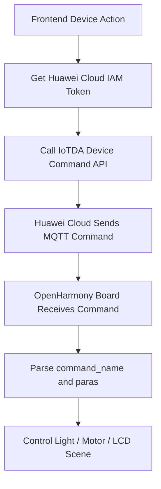

Command example:

```json
{
  "service_id": "智慧农业",
  "command_name": "紫光灯控制",
  "paras": {
    "Light": "ON"
  }
}
```

On the board side, `command_name` determines the control type. `紫光灯控制` controls the light, while `电机控制` controls the motor. The LCD can also display scene images such as morning and arrival scenes.

## Backend Data Model

The backend uses a "user + home-state snapshot" design. Each user owns one home-state record, and rooms, device bindings, device states, scenes, automations, and messages are stored as JSON fields.

| Table | Purpose |
| --- | --- |
| `users` | Account, password hash, display name |
| `user_home_states` | User home-state JSON snapshot |
| `action_logs` | Device actions and execution status |
| `user_store_addresses` | Store addresses and default address |

This design works well for smart-home prototypes because rooms, devices, and automation schemas can evolve quickly without frequent database migrations.

## Project Structure

```text
SmartHome/
  entry/src/main/ets/pages/Index.ets       # Main entry, bottom tabs, home control, smart assistant
  entry/src/main/ets/pages/store/          # Store pages
  entry/src/main/ets/pages/my/             # Profile pages
  entry/src/main/ets/common/               # API, router, Huawei Cloud wrapper
  entry/src/main/ets/smart/                # AI Agent models and parsing logic
  backend/src/main/java/com/smarthome/api/ # Spring Boot backend
  remote_edit/                             # OpenHarmony hardware-side code
  PHOTOS/                                  # Real app screenshots
  report_assets/                           # Report diagrams and auxiliary assets
```

## Run

### Frontend

1. Open the project root in DevEco Studio.
2. Wait for Hvigor and dependencies to load.
3. Select the `entry` module.
4. Run with Previewer or an emulator.

Startup path:

```text
EntryAbility -> windowStage.loadContent('pages/Index') -> Index.ets
```

### Backend

The backend is under `backend/`. It can run with Maven or Docker Compose. The default service port is `8080`, and database settings are configured in `application.yml`.

```bash
cd backend
mvn spring-boot:run
```

## Summary

SmartHome turns smart-home control into spatial interaction. Users can see, select, and control devices directly inside 2.5D home views. With backend account-level synchronization, AI Agent natural language control, and Huawei Cloud IoTDA hardware integration, the project forms a complete loop from UI to data, intelligence, cloud, and real device execution.
